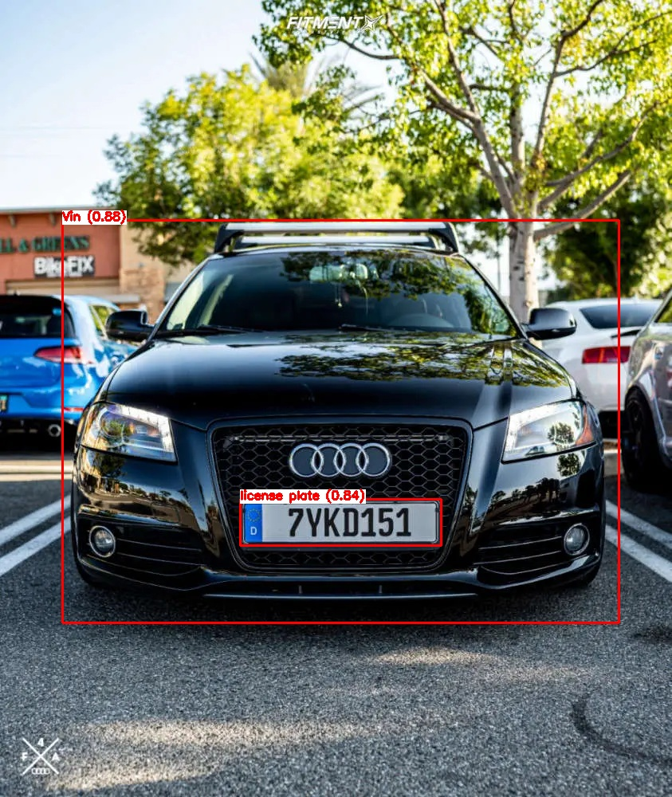
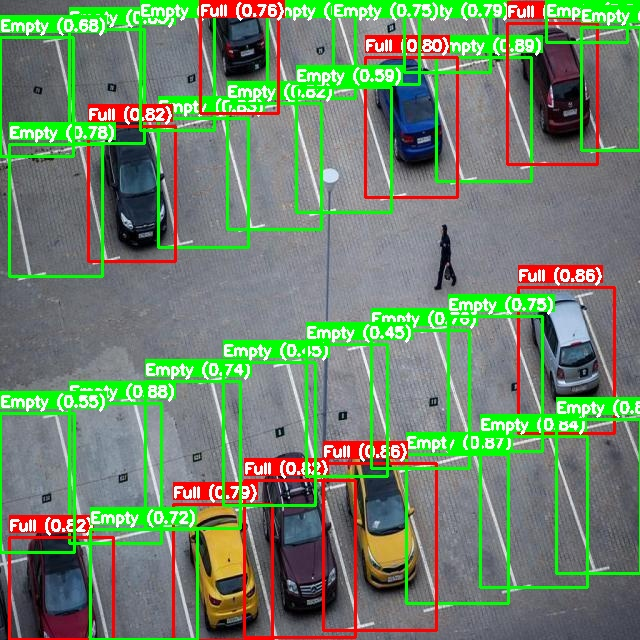

## Vehicle Movement Analysis and Insight Generation in a College Campus using Edge AI

The primary objective of this project is to develop an Edge AI-based solution that can analyse vehicle movement in and out of a college campus using data from cameras capturing vehicle photos and license plates. The solution should provide insights on vehicle movement patterns, parking occupancy, and match vehicles to an approved vehicle database.


## Technologie used

Roboflow, YOLOv8, OpenCV, HTML, CSS, Flask, Python

## Process Flow


## Folder Structure 

1. **Database** - Store data from object Detection_Vehicle_Pattern.py 
    - *database.xlsx*
    - *updates.xlsx*
2. **Documentation** - Report and Outputs of object detections are present here
    - *Architecture diagram.png*
    - *Process Flow.png*
    - *Report.pptx*
3. **Flask App** - Interactive user interface data is drawn from database i.e updates.xlsx
    - *templates*
        - *index.html*
        - *Parking Occupancy.html* 
        - *Vehicle Matching.html*
        - *Vehicle Movement Patterns.html*
        - **app.py**
4. **Results** - Outputs of Objected detection 
    - *annotated_image_1.jpg*
    - *annotated_image_2.jpg*
    - *annotated_image_3.jpg*
5. **Tets images**
    - *Parking Area.jpg*
    - *Vehicle In.webp*
    - *Vehicle Out.jpeg*
6. **Training of Models** - Training two model using YOLOv8 
    - *Parking_Occupancy_Model.ipynb*
    - *Vehicle_Pattern_Analysis_and_License_plate_matching.ipynb*
7. **Weights** - Weights of two models 
    - *model_1.pt*
    - *model_2.pt*
**Detection_Parking_Occupancy.py** performs object detection and updates the data to updates.xlsx

**Detection_Vehicle_Pattern.py**
*Insights Generation.ipynb* Insights for understading peak times and efficient traffic management 

**README.md** - Project documentation file.

**requirements.txt** - Python dependencies.


## Installation

Install requirements.txt

```bash
 pip install -r requirements.txt
```
    
### Features

Vehicle Movement Patterns, 
Vehicle Matching 
    


#### We have trained YOLOv8 model using dataset from Roboflow where we have annotated vehicles with 3 different clasess such as Vin(Vehicle Entering), Vout(Vehicle Exiting), license plate 


Parking Occupancy  
    


#### We have trained one more model using YOLOv8 with Roboflow dataset where we will detect Empty/Full class to find number of Occupancy and available parking slots in college campus 

  
 


## User Interface (Flask App)

#### We have developed interative user Interface with flask python, where user can find the current traffic status of college campus, Apporoved License Plated Vehicles present in campus also the parking occupancy number of occupancy and Available parking slots

*@app.route('/Vehicle Matching')*


*@app.route('/Vehicle Movement Patterns')*


*@app.route('/Parking Occupancy')*


## Authors

- [Jyotiba Maragannache](https://github.com/jyotibasm)
- [Tejashree Hiremath](https://github.com/Tejashreeh17)
- [Vinit Jagwale](https://github.com/VinitJagwale)
- [Samiksha Atiwadkar](https://github.com/jyotibasm)
- [Jaishivarai Bagilgekar](https://github.com/Jaishivarai)


## Conclusion 

The accuracy of our model is 94% for vehicle patterns and 96% for parking occupancy, we look forward to improving the accuracy of our AI model by training it on more and a variety of datasets, because the more data better the model efficiency, we can try to add more features to this project, with this project we have learned, explored a lot and now we can think of solving problems around us using AI/ML & Computer Vision.
